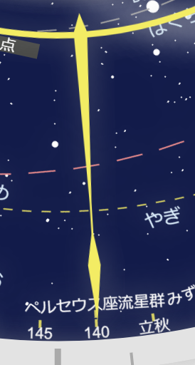

# アナログ時計

[アナログ時計](https://suzuki-navi.github.io/analogclock/)

世界時計、万年カレンダー、天文時計、星座早見盤を兼ねた情報量の多いアナログ時計です。

HTMLファイル1つのみでブラウザで動作し、外部リソースに依存しません。画像、CSS、天文データ等すべてHTMLに埋め込まれています。ローカルでも動きます。

# アナログ時計

現実の物理的な機械仕掛けのアナログ時計と同じように回転する針や円盤などのパーツのみで情報を示します。すべての回転軸は中心で共有しています。とはいっても、内部の歯車やゼンマイまでは再現しておらず、見える範囲だけ機械仕掛けの時計です。

時刻だけでなく年月日もアナログ表示です。1年で1回転する針やカレンダー上の日付を指す針、年号を指す針があります。

時計の針や円盤の多くはマウスで動かすことができます。動かすと時計の時間を調整できます。一度時間を変更すると秒針が止まりますが、秒針を少し動かすとまた時間を刻み始めます。秒針を大きく動かすと自動で現在日時に戻ります。

## デジタル時計

円盤の領域外となる左下の隅にはデジタル表示もあります。上から順に、日付、時刻、Unix Time、修正ユリウス日が表示されています。

Unix Timeは1970年1月1日0時UTCからの秒数（うるう秒をカウントせず）です。コンピュータの中で日時を表現するために使われます。

修正ユリウス日は1858年11月17日0時UTCからの日数で、ユリウス日から2400000.5を引いた値です。天文学でよく使われます。

この時計の実装でもUnix Timeと修正ユリウス日を使っています。

# 世界時計

世界各地の主要都市の時刻がわかります。都市名が外側の0から23までの数字を指しています。各都市の夏時間までは反映できません。夏時間の制度がある年には*印を付けていますので、夏ならば脳内で1時間加算してください。夏時間の期間も都市によって異なります。

この時計の短針については、UTC+9のタイムゾーンで固定です。PCやスマホのタイムゾーン設定に関係ありません。また、星座早見盤の地平線の形は東京付近を基準にしています。

# 万年カレンダー

万年カレンダーとはパーツをスライドさせたりして任意の年月を表示できるカレンダーのことで、この時計では日付を印字している円盤を毎月自動で回転することで毎月のカレンダーを表示しています。

月末が31日なのか30日なのか、2月なら28日なのか29日なのかは、不要な日付を隠す専用のパーツを移動させることで表現しています。

カレンダーの下には1月から12月の文字盤がありますが、面積の節約のために「12月」の表記はカレンダーの6週目の段と重なっています。6週目のある月では「12月」の表記が隠れます。このため2024年など、12月に「12月」と表示できない年もあります。

# 星座早見盤

この時計には星座早見盤が付いています。現在時刻または任意の日時の星空がわかります。

星座早見盤は日付と時刻を合わせることでその日時に見える星座とその方向がわかる円盤ですが、この時計では時計が指す日時と連動します。星座の表示盤が1年で反時計回りに1周し、地平線のパーツが1日で時計回りに1周します。地平線のパーツは世界時計の回転と同期しています。

円盤の外側左下にある月の絵文字をクリックするとナイトモードになります。星を見るような暗闇の環境で見ることを想定して真っ黒な画面になります。

北天の星空と南天の星空で表示領域が分割されています。北天は時計の中央にあります。南天は外周にあります。東西と天頂付近は南天側です。

外周の南天は通常の星座早見盤と異なり黄道が同心円で描かれています。赤道が歪んだ円になっています。そのため夏の星座は内側に寄り、冬の星座は外側に寄っています。昼間の空はカレンダーと重なっているため、夕方の西の空、明け方の東の空の特に夏の星座が星座早見盤に見えていない場合があります。

赤道が歪んでいるため、地平線の形も本来は季節や時間帯によって変わります。この星座早見盤では東西の地平線を北緯35.7度での平均的な形で示しています。東西の地平線と黄道の交点が実際と一致するように計算され、回転しています。黄道から離れた方角の地平線には季節や時間帯によってずれがあります。北の地平線は形が一定ですので、北緯35.7度での実際の形に合わせています。

南の地平線は方角のみを示します。南の地平線近くの星座には描かれていないものもあります。

この時計は東京付近が基準です。星空の位置の根拠となる恒星時は東経139.7度で計算しています。地平線の形は北緯35.7度で計算しています。

# 天文時計

この時計には天文時計の機能もあります。星座早見盤に太陽や月、惑星の位置が示されています。日食、月食もわかります。流星群もわかります。

太陽や月、惑星の位置は地球から見た方向です。

天体の位置計算はJavaScriptで簡易的に計算しています。そのため誤差があります。

## 太陽

太陽は常に時計の12時付近にいますが、1年かけてわずかに左右に振れています。これは、地球の自転軸が傾いていることと、公転軌道が楕円を描いていることにより、地表から見た太陽の動きが一定でないことが理由です。また、太陽が12時よりも左にあることが多いのですが、これは太陽が真南を通過するのが東京では12時よりも前であることを示します。

## 月

月は1か月かけて時計回りに周回しています。満ち欠けも表現しています。太陽の右にいるときは三日月で、夕方西の空に見えます。3時の方向にいるときが上弦、下の太陽と反対方向にある黄色の針の位置にいるときが満月、9時の方向にいるときが下弦です、太陽と重なっているときが新月です。以下は満月のときの様子です。

近地点に近い満月は見た目の大きさがいつもよりも大きく見えます。地球に近いためです。スーパームーンとも呼ばれます。

## 内惑星

水星と金星は太陽の近くを左右に往復しています。太陽の右側のときは夕方西の空に見えます。左側のときは明け方東の空に見えます。満ち欠けを表現していますが、肉眼で水星や金星の満ち欠けを確認することはできません。満月状のときは太陽の向こう側、新月に近いときは太陽の手前側にいることを示します。金星は三日月状のときに最も明るくなります。

以下では、左端が太陽、中央に見えるのが水星、右端が金星です。

## 外惑星

火星、木星、土星は星座とともにゆっくり反時計回りに周回しています。下半分にいるときは夜間に見やすいです。太陽に近いときは水星や金星と同様に、右側は夕方、左側は明け方に見えます。

太陽と反対にある黄色の針に火星、木星、土星が来る時期は衝といい、一晩中見えるようになり、また地球に近づいているので最も明るく見えるようになります。以下は木星が衝のときの様子です。

火星は2年2か月かけて1周します。衝になるのも2年2か月に一度です。火星が火星近日点の付近で衝になると大接近といい、衝の中でも特に地球に近づきます。大接近は15年から17年に一度の周期です。火星遠日点付近は小接近となります。火星近日点と火星遠日点の表記は太陽から見た火星の方向であり、この時計の火星は地球から見た方向ですので、火星が衝または合のときにしかこの表記は意味をなしません。以下は火星近日点の近くで衝となり大接近している様子です。

土星環消失の表記の場所に土星が来ると土星の輪が消えます。15年ごとに来る環消失の1年くらいの期間に2回から4回の消失が起きます。正確な日時まではこの時計ではわかりません。

日食・月食もわかります。月が惑星や恒星を隠す星食もわかります。ただし食は目安のみであり、正確な予報ができるわけではありません。月の昇交点または降交点付近で新月または満月になると日食または月食になります。地球のどこで見られるかまではこの時計ではわかりません。新月のときはこの時計では太陽が月に隠されるように見えますが、新月のたびに日食になるのではなく、日食は年に数回に限られます。以下は月食のときの様子です。

## 流星群

主要な流星群の極大の時期もわかります。時計の下半分にある黄色い針がさしています。黄色い針は上向きと下向きがあり、春から夏は下向き、秋から冬は上向きの針が流星群

----
